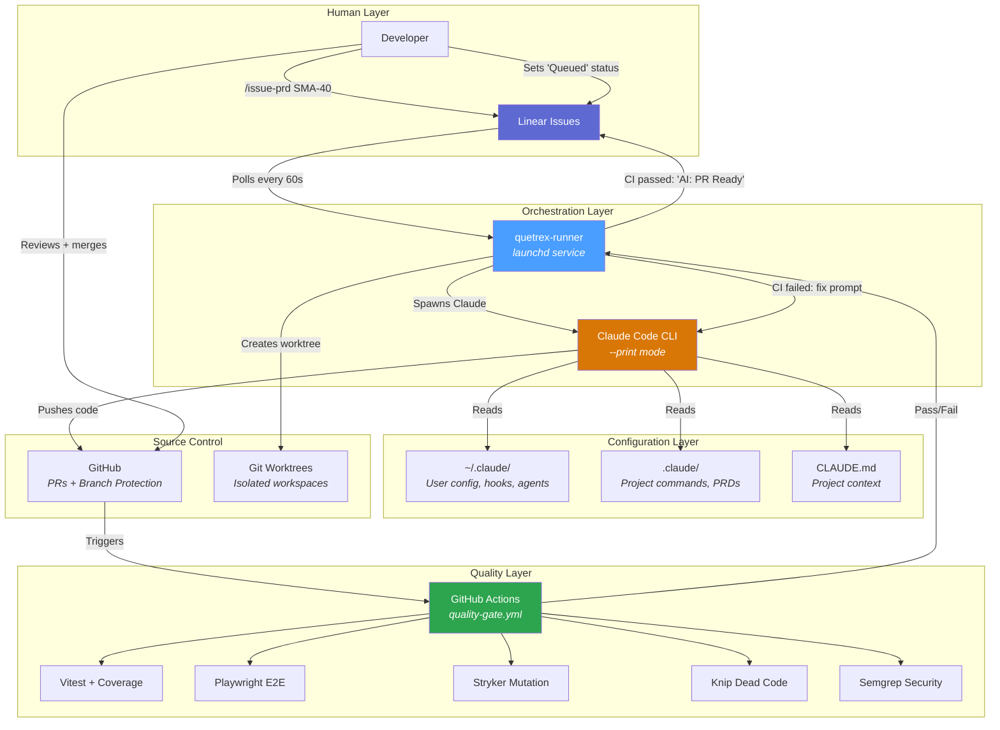
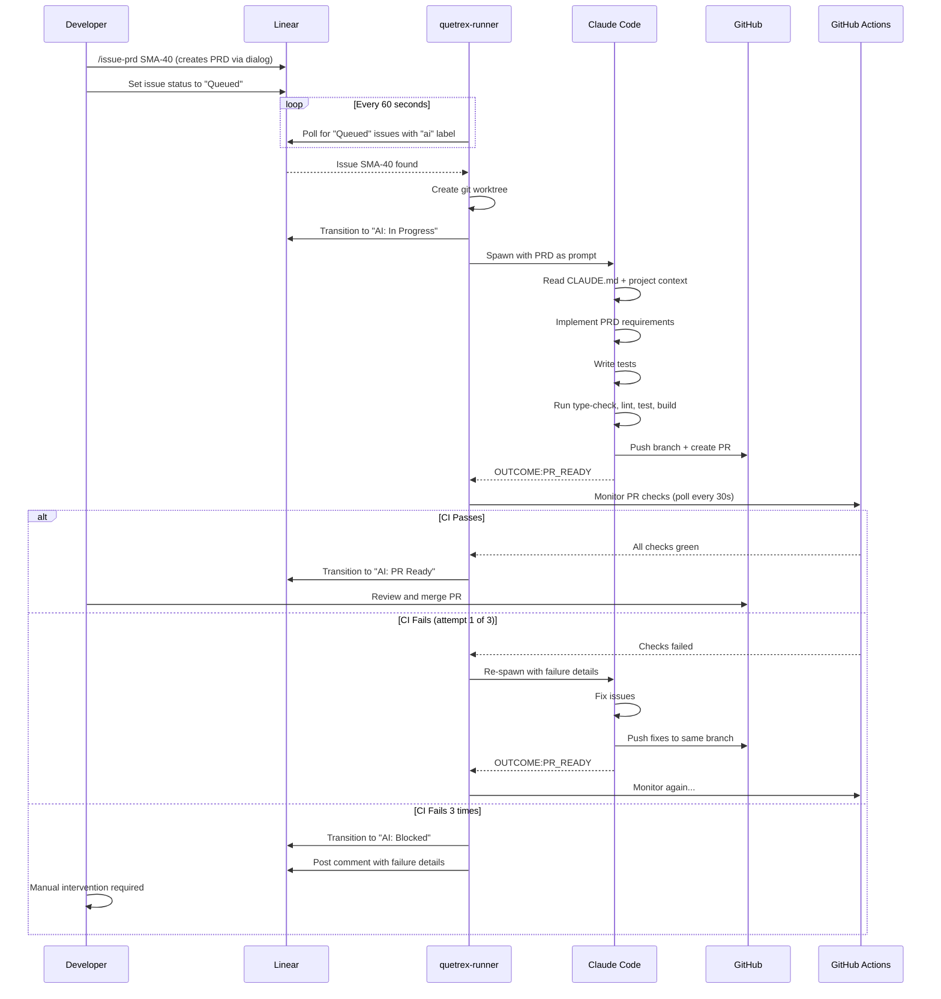
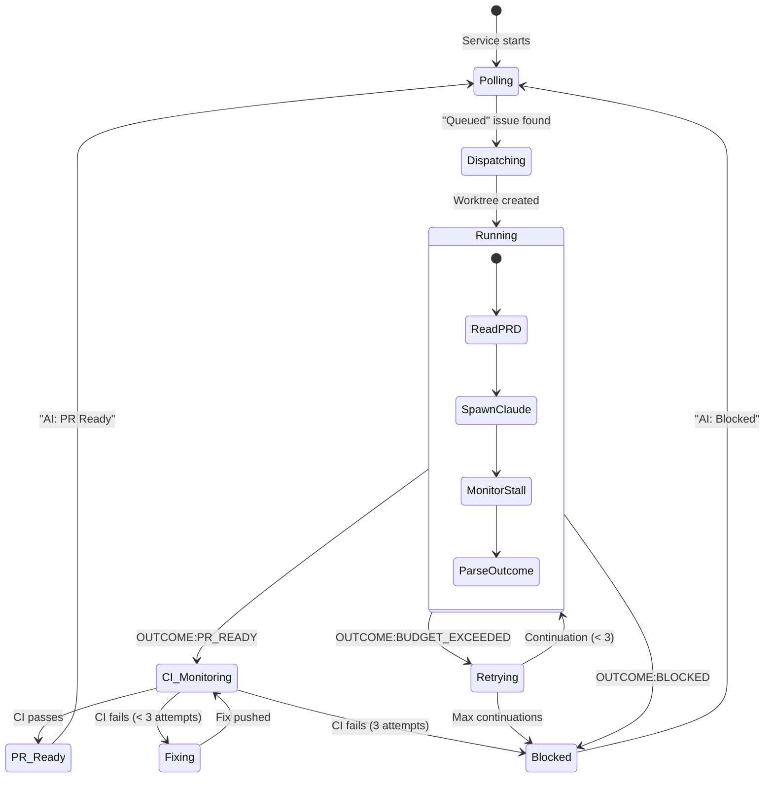
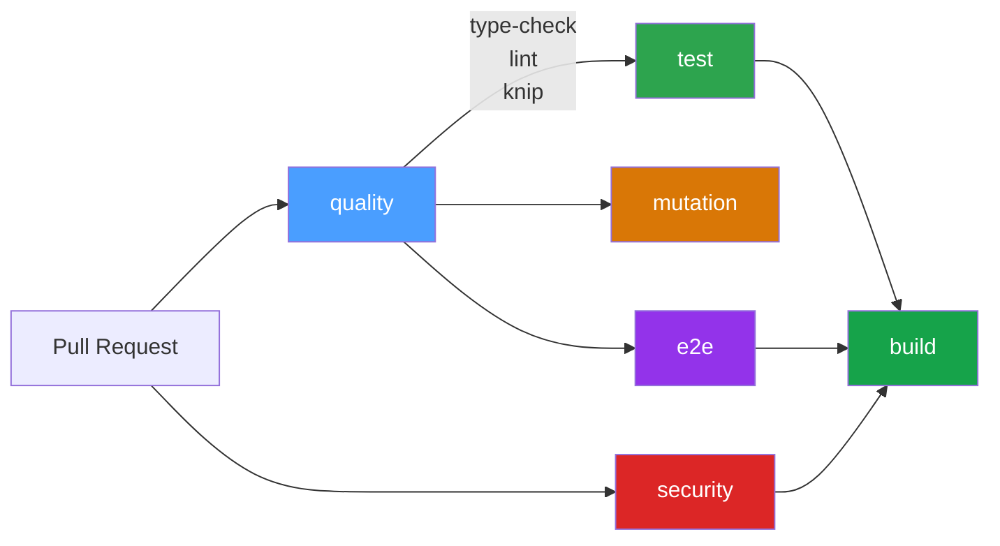
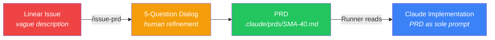
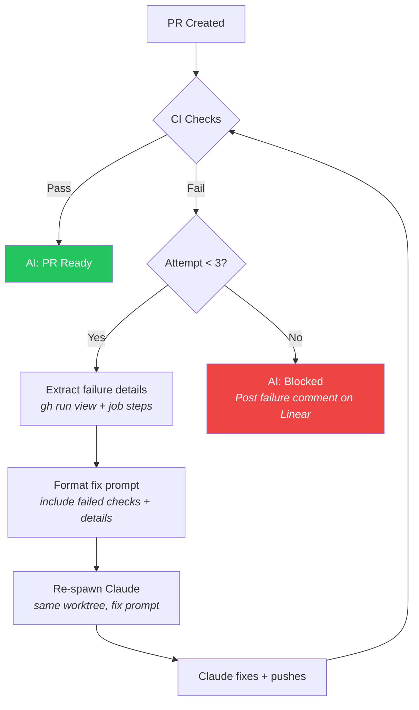
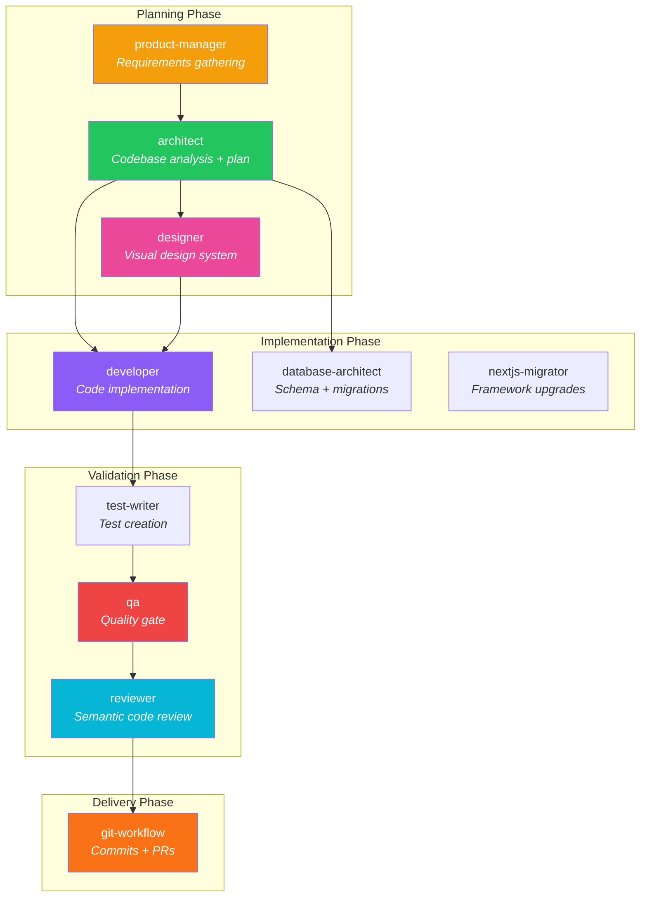

# Quetrex Automation System

> A production-grade CI/CD pipeline that connects Linear project management to autonomous Claude Code agents, with GitHub Actions as the quality gate.

---

## Table of Contents

- [Architecture Overview](#architecture-overview)
- [System Flow](#system-flow)
- [Components](#components)
  - [1. User Configuration (~/.claude/)](#1-user-configuration-claude)
  - [2. Project Template (quetrex-base)](#2-project-template-quetrex-base)
  - [3. Automation Runner (quetrex-runner)](#3-automation-runner-quetrex-runner)
  - [4. GitHub Actions CI (quality-gate.yml)](#4-github-actions-ci-quality-gateyml)
- [Workflows](#workflows)
  - [Workflow 1: Automated (Runner)](#workflow-1-automated-runner)
  - [Workflow 2: Interactive (Developer)](#workflow-2-interactive-developer)
- [PRD-Driven Development](#prd-driven-development)
- [CI Retry Loop](#ci-retry-loop)
- [Hook System](#hook-system)
- [Agent Definitions](#agent-definitions)
- [Dependencies](#dependencies)
- [Setup Guide](#setup-guide)

---

## Architecture Overview



---

## System Flow



---

## Components

### 1. User Configuration (~/.claude/)

The user-level configuration that applies across **all projects** on this machine.

```
~/.claude/
├── CLAUDE.md              # Global preferences (33 lines)
├── settings.json          # Hooks, permissions, env vars
├── team-protocol.md       # Agent team coordination rules
├── hooks/
│   ├── enforce-branch.sh  # PreToolUse: blocks commits on main
│   ├── auto-format.sh     # PostToolUse: Biome format on save
│   └── security-check.sh  # PreToolUse: blocks hardcoded secrets
└── agents/
    ├── architect.md        # Strategic analysis, no code
    ├── designer.md         # Visual design systems
    ├── developer.md        # Code implementation
    ├── test-writer.md      # Test creation
    ├── qa.md               # Quality assurance gate
    ├── reviewer.md         # Semantic code review
    ├── git-workflow.md     # Git operations
    ├── product-manager.md  # Requirements gathering
    ├── database-architect.md  # Schema design
    └── nextjs-migrator.md  # Next.js upgrades
```

**Key design decisions:**
- CLAUDE.md is kept under 40 lines per Anthropic's recommendation
- Only 3 hooks (down from 7) -- deterministic actions only
- Quality enforcement moved to CI, not local hooks
- Agent teams enabled via `CLAUDE_CODE_EXPERIMENTAL_AGENT_TEAMS=1`
- Permissions use `dontAsk` mode for CI/automated workflows

### 2. Project Template (quetrex-base)

The template repo that new projects clone from. Contains the `.claude/` commands and CI configuration.

```
quetrex-base/
├── .claude/
│   ├── CLAUDE-template.md         # Template for /create-rules
│   ├── commands/
│   │   ├── issue-prd.md           # Linear -> dialog -> PRD
│   │   ├── create-prd.md          # Standalone PRD creation
│   │   ├── prime.md               # Load project context
│   │   ├── create-rules.md        # Generate CLAUDE.md + CI + tooling
│   │   ├── plan-feature.md        # Deep implementation planning
│   │   ├── execute.md             # Execute a plan
│   │   └── commit.md              # Atomic commit workflow
│   └── prds/
│       └── .gitkeep               # PRD storage directory
└── .github/
    └── workflows/
        └── quality-gate.yml       # 6-job CI pipeline
```

**Commands reference:**

| Command | Purpose | When to use |
|---------|---------|-------------|
| `/issue-prd <ID>` | Fetch Linear issue, run 5-question dialog, generate PRD | Before any automated work |
| `/create-prd` | Create PRD from conversation (no Linear) | Ad-hoc feature planning |
| `/prime` | Load codebase context, check health, list PRDs | Start of every session |
| `/create-rules` | Generate CLAUDE.md + CI workflow + Stryker + Knip | New project setup |
| `/plan-feature` | Deep codebase analysis, create implementation plan | Complex features |
| `/execute <plan>` | Execute a plan step by step | After /plan-feature |
| `/commit` | Stage, commit with proper message | After implementation |

### 3. Automation Runner (quetrex-runner)

A Python launchd service that runs 24/7, polling Linear for issues and spawning Claude Code to implement them.



**Key modules:**

| Module | Responsibility |
|--------|---------------|
| `scheduler.py` | Poll loop, task dispatch, CI monitoring loop, Linear state transitions |
| `executor.py` | PRD reading, Claude process management, OUTCOME signal parsing |
| `ci_monitor.py` | `gh pr checks` polling, failure detail extraction, fix prompt generation |
| `config.py` | All configuration with Pydantic validation |
| `linear_client.py` | Linear GraphQL API client |
| `worktree.py` | Git worktree creation/cleanup |
| `state.py` | Persistent state, crash recovery, retry tracking |
| `metrics.py` | Task duration, success/failure metrics |

**Configuration (`~/.claude-runner/config.json`):**

```json
{
  "poll_interval_seconds": 60,
  "max_concurrent": 3,
  "max_retries_per_issue": 3,
  "max_ci_fix_attempts": 3,
  "ci_check_timeout_seconds": 600,
  "ci_poll_interval_seconds": 30,
  "max_execution_timeout": 3600,
  "max_continuations_per_issue": 3,
  "claude_permission_mode": "acceptEdits",
  "linear_label_filter": "ai",
  "project_map": {
    "DealerQ": "dealerq-2026"
  }
}
```

**launchd service:**
- Plist: `~/Library/LaunchAgents/com.quetrex.claude-runner.plist`
- Runs via: `/bin/bash scripts/launch-runner.sh`
- LINEAR_API_KEY pulled from macOS Keychain (never in plaintext)
- KeepAlive: true (auto-restart on crash)
- Logs: `~/.claude-runner/logs/`

### 4. GitHub Actions CI (quality-gate.yml)

The quality gate that determines whether a PR is mergeable. This is the **sole arbiter of code quality** -- local hooks handle formatting and safety, CI handles correctness.



| Job | Tools | Blocking? |
|-----|-------|-----------|
| **quality** | TypeScript type-check, ESLint/Biome lint, Knip dead code | Yes |
| **test** | Vitest with coverage (80% threshold) | Yes |
| **mutation** | Stryker Mutator (mutation score) | No (advisory) |
| **e2e** | Playwright (Chromium) | Yes |
| **security** | Semgrep (TypeScript ruleset) | Yes |
| **build** | Next.js production build | Yes |

---

## Workflows

### Workflow 1: Automated (Runner)

For issues that go through the full pipeline without human intervention until PR review.

```
1. Developer runs /issue-prd SMA-40 in Claude Code
2. 5-question dialog refines the PRD
3. PRD committed to .claude/prds/SMA-40.md
4. Developer sets Linear issue to "Queued"
5. quetrex-runner picks it up (polls every 60s)
6. Runner creates worktree, spawns Claude with PRD
7. Claude implements, tests, pushes, creates PR
8. Runner monitors CI (polls every 30s)
9. If CI fails: re-spawn Claude with failure details (max 3 attempts)
10. If CI passes: set Linear to "AI: PR Ready"
11. Developer reviews and merges
```

### Workflow 2: Interactive (Developer)

For working directly with Claude Code in the terminal.

```
1. Developer runs /prime to load project context
2. Developer runs /plan-feature to create implementation plan
3. Work together -- Claude implements, developer guides
4. Run /commit when ready
5. Push and create PR manually
6. CI validates on GitHub
```

---

## PRD-Driven Development

The PRD (Product Requirements Document) is the **sole source of truth** for automated work. It bridges the gap between a vague Linear issue description and a complete implementation specification.



**PRD structure:**
- Overview + User Story
- Detailed Requirements (full user flow, all UI states, validation rules)
- Architecture (files to modify/create, patterns to follow with file:line refs)
- Database Changes
- API Changes
- Testing Requirements (unit tests, E2E tests, mutation testing target)
- Acceptance Criteria (measurable, CI-verifiable)

**Why PRDs matter:**
- AI-generated code has ~1.7x more defects than human code (research finding)
- AI-generated tests achieve only ~20% mutation scores without guidance
- A detailed PRD with explicit test cases dramatically improves both metrics
- The /issue-prd dialog ensures a human validates every requirement

---

## CI Retry Loop

When CI fails, the runner doesn't give up immediately. It feeds failure details back to Claude for automated fixes.



**Fix prompt includes:**
- Which checks failed (names)
- Failed job steps from the GitHub Actions run
- Path to the PRD for context
- Instructions to fix and push to the **same branch** (no new PR)

---

## Hook System

Hooks are lightweight, deterministic checks that run on every tool invocation. They handle safety and formatting -- not quality (that's CI's job).

| Hook | Trigger | What it does |
|------|---------|--------------|
| `enforce-branch.sh` | PreToolUse: Bash | Blocks `git commit` and `git push` on main/master. Parses `cd /path &&` and `git -C /path` patterns to check the target repo's branch. |
| `security-check.sh` | PreToolUse: Write | Scans file content for AWS keys (`AKIA...`), private keys, Slack tokens, GitHub PATs, Linear API keys. Blocks the write if found. |
| `auto-format.sh` | PostToolUse: Write\|Edit | Walks up from the edited file to find `biome.json`. Runs `npx biome format --write` on JS/TS/JSON files. |

---

## Agent Definitions

Ten specialized agents handle different aspects of the development lifecycle. Each runs as a separate Claude instance with its own context.



**Key rule**: No two agents edit the same file. Work is split along file boundaries with shared types completing first.

---

## Dependencies

### Runtime Dependencies

| Dependency | Version | Purpose | Location |
|------------|---------|---------|----------|
| Claude Code CLI | Latest | AI code generation | Global install |
| Python 3.13+ | 3.13 | quetrex-runner | System |
| Node.js | 22+ | Project builds | System |
| GitHub CLI (`gh`) | Latest | PR creation, CI monitoring | System |
| Linear API | GraphQL | Issue management | API |
| macOS Keychain | System | SECRET_API_KEY storage | System |
| launchd | System | Runner service management | macOS |

### Python Dependencies (quetrex-runner)

| Package | Purpose |
|---------|---------|
| `pydantic` | Configuration validation |
| `httpx` | Async HTTP for Linear API |

### Node.js Testing Stack

| Tool | Purpose | License |
|------|---------|---------|
| Vitest | Unit/integration tests + coverage | MIT |
| Playwright | E2E browser testing | Apache-2.0 |
| Stryker Mutator | Mutation testing (test quality validation) | Apache-2.0 |
| Knip | Dead code / unused export detection | ISC |
| Semgrep | Static security analysis | LGPL-2.1 |
| Biome | Linting + formatting | MIT |

### MCP Servers

| Server | Purpose |
|--------|---------|
| Context7 | Latest library documentation (replaces frozen skill docs) |

---

## Setup Guide

### For a New Project

1. **Clone the template:**
   ```bash
   cp -r quetrex-base/.claude/ your-project/.claude/
   cp -r quetrex-base/.github/ your-project/.github/
   ```

2. **Generate project rules:**
   ```bash
   cd your-project
   claude "/create-rules"
   ```
   This analyzes the codebase and creates:
   - `CLAUDE.md` (project-specific context)
   - `.github/workflows/quality-gate.yml` (if missing)
   - `stryker.config.mjs` (if missing)
   - `knip.json` (if missing)

3. **Install testing dependencies:**
   ```bash
   npm install -D vitest @vitest/coverage-v8 \
     @stryker-mutator/core @stryker-mutator/vitest-runner \
     @stryker-mutator/typescript-checker \
     knip
   ```

4. **Map the project in the runner config:**
   ```bash
   # Edit ~/.claude-runner/config.json
   # Add to project_map: { "Your Linear Project": "your-project-dir" }
   ```

5. **Set up branch protection:**
   ```bash
   gh api repos/OWNER/REPO/branches/main/protection \
     --method PUT \
     --field required_status_checks='{"strict":true,"contexts":["quality","test","e2e","security","build"]}' \
     --field enforce_admins=true \
     --field required_pull_request_reviews='{"required_approving_review_count":1}'
   ```

### For the Runner

1. **Install:**
   ```bash
   cd quetrex-runner
   pip install -e .
   ```

2. **Store API key in Keychain:**
   ```bash
   security add-generic-password -a quetrex-runner -s LINEAR_API_KEY -w YOUR_KEY
   ```

3. **Load the launchd service:**
   ```bash
   launchctl load ~/Library/LaunchAgents/com.quetrex.claude-runner.plist
   ```

4. **Verify it's running:**
   ```bash
   launchctl list | grep quetrex
   tail -f ~/.claude-runner/logs/launchd-stdout.log
   ```
